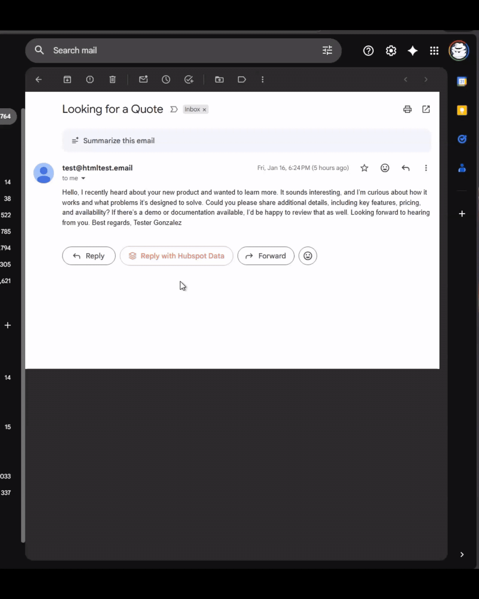
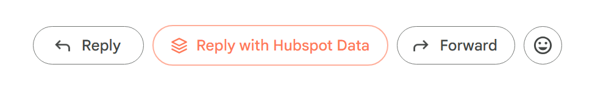

# HubSpot Gmail AutoDraft Extension

An open source project to test out Claude Code.

## Demo



Close-up of the buttons in Gmail:



## About

This is a custom browser extension for Microsoft Edge (and Chrome) that enhances Gmail with AI-powered email response generation. The extension combines HubSpot contact data with OpenAI's API to generate contextually relevant, professional email responses directly within Gmail.

## Features

- **AI-Powered Email Responses**: Generate professional email replies with a single click
- **HubSpot CRM Integration**: Automatically enriches AI responses with contact information from your HubSpot CRM
- **Gmail Content Script**: Seamlessly integrates "Reply with Hubspot Data" button into Gmail's interface
- **Settings Page**: Easy configuration of HubSpot and OpenAI API credentials
- **Context-Aware AI**: Uses full email thread history and contact profile for personalized responses

## Tech Stack

- **Build Tool**: Vite + @crxjs/vite-plugin
- **Framework**: React 18 + TypeScript
- **Extension**: Manifest V3 (Edge/Chrome compatible)
- **APIs**: HubSpot Contacts API, OpenAI API

## Prerequisites

Before using this extension, you'll need:

1. **HubSpot Private App Access Token**
   - Create a private app in HubSpot: [HubSpot Private Apps Documentation](https://developers.hubspot.com/docs/api/private-apps)
   - Required scopes: `crm.objects.contacts.read`

2. **OpenAI API Key**
   - Get your API key from: [OpenAI Platform](https://platform.openai.com/api-keys)

## Installation

### Development Setup

1. **Clone the repository**
   ```bash
   git clone <repository-url>
   cd HubSpotProject
   ```

2. **Install dependencies**
   ```bash
   npm install
   ```

3. **Build the extension**
   ```bash
   npm run build
   ```

4. **Load the extension in Edge/Chrome**
   - Open `edge://extensions` (or `chrome://extensions`)
   - Enable "Developer mode" (toggle in top right)
   - Click "Load unpacked"
   - Select the `dist` folder from the project directory

### Configure API Keys

1. Click the extension icon in your browser toolbar
2. Select "Options" or right-click and choose "Settings"
3. Enter your HubSpot Private App Access Token
4. Enter your OpenAI API Key
5. Test both connections using the "Test Connection" buttons
6. Click "Save Settings"

## Usage

1. **Open Gmail**: Navigate to https://mail.google.com
2. **Open an email thread**: Click on any email to view the thread
3. **Click Reply**: Start composing a reply as you normally would
4. **Click "Reply with Hubspot Data"**: Look for the button in the compose toolbar
5. **Review and send**: The AI-generated response will appear in the compose box. Review, edit if needed, and send!

## How It Works

1. **Email Context Extraction**: When you click "Reply with Hubspot Data", the extension extracts:
   - Email thread content (all messages)
   - Sender email address
   - Email subject and metadata

2. **HubSpot Contact Lookup**: The extension searches HubSpot for the sender's contact profile:
   - Name, company, job title
   - Phone number and other contact details
   - If no contact is found, the extension continues without this context

3. **AI Response Generation**: The extension sends to OpenAI API:
   - Full email thread
   - HubSpot contact information (if available)
   - Your profile information (job title, communication style, etc.)
   - A professional email assistant prompt

4. **Response Insertion**: The generated response is automatically inserted into Gmail's compose box for your review

## Development

### Project Structure

```
HubSpotProject/
├── src/
│   ├── api/           # HubSpot and OpenAI API integrations
│   ├── content/       # Gmail content script and button component
│   ├── settings/      # Extension settings page
│   ├── utils/         # Storage and Gmail DOM utilities
│   └── types/         # TypeScript type definitions
├── public/
│   └── icons/         # Extension icons
├── manifest.json      # Extension manifest (Manifest V3)
├── vite.config.ts     # Vite build configuration
└── package.json       # Dependencies and scripts
```

### Development Mode

To run in development mode with hot reload:

```bash
npm run dev
```

Then load the extension from the `dist` folder in your browser.

### Build for Production

```bash
npm run build
```

## Important Notes

- **API Costs**: This extension uses OpenAI's API, which has usage costs. Monitor your OpenAI usage dashboard.
- **Gmail Compatibility**: Tested on Gmail's standard interface. May require adjustments for custom themes or Gmail updates.
- **Privacy**: API keys are stored securely in Chrome's local storage. Never shared with third parties.

## Troubleshooting

### Button not appearing in Gmail
- Refresh Gmail page
- Check that extension is enabled in `edge://extensions`
- Check browser console for errors (F12 → Console tab)

### "Please configure API keys" error
- Go to extension settings
- Verify both HubSpot and OpenAI keys are entered correctly
- Test connections to ensure keys are valid

### Generated response not inserting
- Try clicking in the compose box first, then click "Reply with Hubspot Data"
- Check browser console for errors
- Gmail's DOM may have changed - may need content script updates

### HubSpot contact not found
- Verify the sender's email exists in your HubSpot contacts
- Check HubSpot token has `crm.objects.contacts.read` scope
- The extension will still generate responses without HubSpot data

## Future Enhancements

- Caching of HubSpot contact data to reduce API calls
- Support for multiple AI models for faster/cheaper responses
- Custom prompt templates
- Rate limiting and usage tracking
- Support for multiple email threads
- Better icon design

## Contributing

This project is open source and contributions are welcome! Feel free to:
- Report bugs via GitHub Issues
- Suggest features
- Submit pull requests

## License

MIT License (or your preferred license)

## Acknowledgments

Built using [Claude Code](https://claude.com/claude-code) for AI-assisted development.

## Disclaimer

This is an independent project and is not officially affiliated with HubSpot, OpenAI, or Google.
